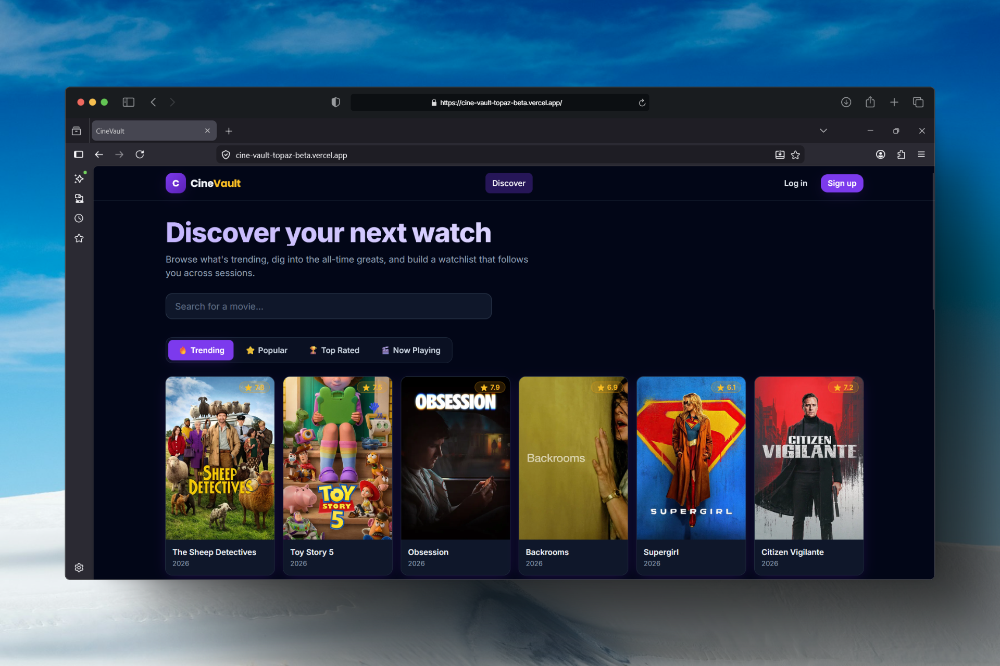
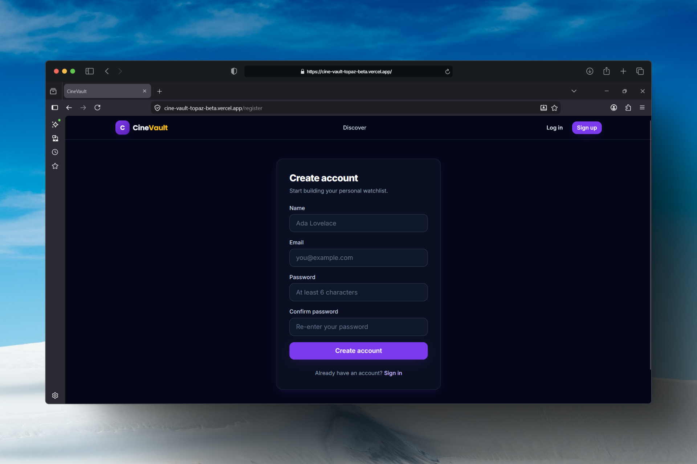
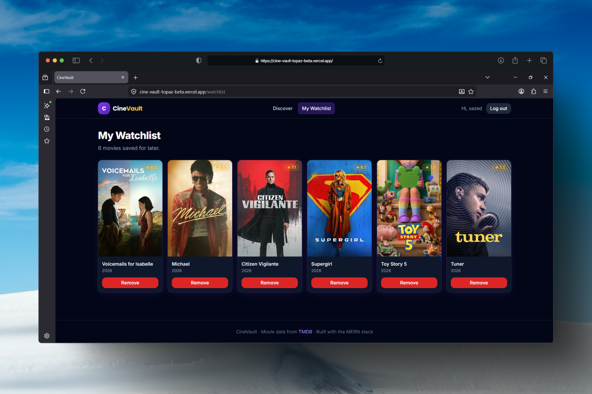
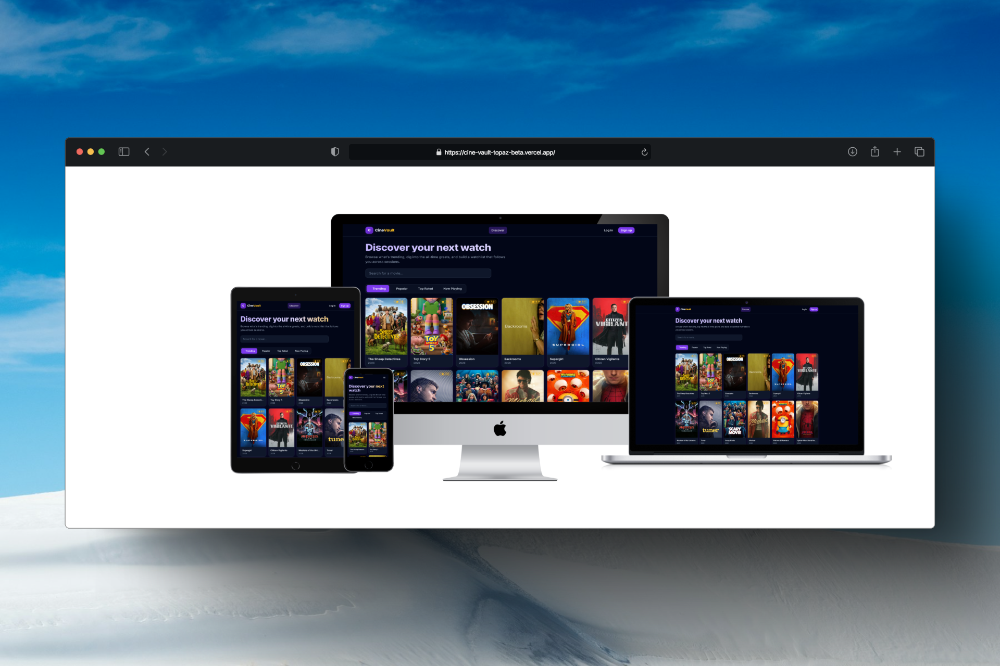

# 🎬 CineVault

A full-stack **MERN** movie database. Browse what's trending, search the entire TMDB catalog, dive into cast lists and trailers, and save films to a personal watchlist that persists across sessions.

The engineering centerpiece of this app is **infinite scroll backed by a cached, key-hiding TMDB proxy** — the browser never sees the API key, and repeat requests are served from an in-memory cache instead of hammering the upstream API.

---

## ✨ Features

- **Discover feed** with Trending / Popular / Top Rated / Now Playing tabs
- **Infinite scroll** powered by React Query's `useInfiniteQuery` + an `IntersectionObserver` sentinel (with a "Load more" fallback button)
- **Full-text search** across TMDB with debounced input
- **Movie detail pages** — backdrop, overview, genres, runtime, top-billed cast, and an embedded YouTube trailer
- **JWT authentication** (register / login) with bcrypt-hashed passwords
- **Per-user watchlist** — add/remove movies, stored against your account
- **Cached backend proxy** — TMDB key stays server-side; lists/detail/search responses are cached with sensible TTLs
- **Polished, responsive UI** — Tailwind CSS, a violet + gold "vault" theme, skeleton loaders, empty/error states, and toast notifications

---

## 🧱 Tech stack

**Frontend**
- React 17 + React Router 6
- React Query (TanStack Query v3) for data fetching, caching & infinite scroll
- Axios, React Toastify
- Tailwind CSS

**Backend**
- Node.js + Express 4
- MongoDB + Mongoose 6
- JSON Web Tokens + bcryptjs
- node-cache (in-memory response cache)
- helmet, express-rate-limit, express-validator, morgan, cors

---

## 📁 Project structure

```
cinevault/
├── client/                  # React frontend
│   ├── public/
│   └── src/
│       ├── api/             # axios instance + endpoint wrappers
│       ├── components/      # reusable UI (MovieCard, Navbar, Button, …)
│       ├── context/         # AuthContext (JWT session)
│       ├── hooks/
│       ├── pages/           # Home, MovieDetail, Watchlist, Login, Register, NotFound
│       ├── App.js
│       └── index.js
│
├── server/                  # Express backend
│   └── src/
│       ├── config/          # Mongo connection
│       ├── controllers/     # auth, movies, watchlist
│       ├── middleware/      # auth guard, error handling
│       ├── models/          # User (watchlist embedded)
│       ├── routes/
│       ├── services/        # tmdbService — the cached proxy
│       ├── utils/
│       └── server.js
│
├── package.json             # root scripts (runs client + server together)
└── README.md
```

---

## 🚀 Getting started

### Prerequisites
- **Node.js 16+** and npm
- A **MongoDB** database (local `mongod`, or a free MongoDB Atlas cluster)
- A **TMDB API key** — create a free account at [themoviedb.org](https://www.themoviedb.org), then go to **Settings → API** and copy your **API Key (v3 auth)**

### 1. Install dependencies

From the project root, install everything (root, server, and client) in one go:

```bash
npm run install-all
```

### 2. Configure environment variables

**Server** — copy the example and fill in your values:

```bash
cp server/.env.example server/.env
```

| Variable         | Description                                           | Example                                 |
| ---------------- | ----------------------------------------------------- | --------------------------------------- |
| `PORT`           | Port the API listens on                               | `5000`                                  |
| `NODE_ENV`       | `development` or `production`                          | `development`                           |
| `MONGO_URI`      | MongoDB connection string                             | `mongodb://127.0.0.1:27017/cinevault`   |
| `JWT_SECRET`     | Secret used to sign JWTs (use a long random string)   | `super-secret-change-me`                |
| `JWT_EXPIRES_IN` | Token lifetime                                        | `7d`                                    |
| `CLIENT_URL`     | Frontend origin, for CORS                             | `http://localhost:3000`                 |
| `TMDB_API_KEY`   | Your TMDB v3 API key                                  | `abc123…`                               |

**Client** — copy the example:

```bash
cp client/.env.example client/.env
```

| Variable             | Description                  | Example                       |
| -------------------- | ---------------------------- | ----------------------------- |
| `REACT_APP_API_URL`  | Base URL of the backend API  | `http://localhost:5000/api`   |

### 3. Run it

```bash
npm run dev
```

This boots both servers together:
- Frontend → **http://localhost:3000**
- API → **http://localhost:5000**

> You can also run them separately with `npm run server` and `npm run client`.

---

## 🔐 The engineering lesson

### 1. A cached proxy that hides your API key

The browser never talks to TMDB directly. Every request goes to **our** Express API, which attaches the secret key server-side and forwards the call. This means:

- **The TMDB key is never exposed** to the client bundle or network tab.
- Responses are **reshaped** into a clean, frontend-friendly format (full image URLs, trimmed fields) so the client doesn't depend on TMDB's raw schema.
- Responses are **cached in memory** with `node-cache`, so popular pages don't re-hit the upstream API:

| Data       | TTL        |
| ---------- | ---------- |
| Lists      | 1 hour     |
| Detail     | 6 hours    |
| Search     | 10 minutes |

Upstream errors are translated into clean status codes (e.g. a misconfigured key surfaces as a generic 500 rather than leaking provider details).

### 2. Infinite scroll done right

The discover feed uses React Query's `useInfiniteQuery`. The next-page cursor comes from TMDB's `page` / `total_pages` (capped at TMDB's 500-page limit). An `IntersectionObserver` watches a sentinel element near the bottom of the list and calls `fetchNextPage()` *before* the user actually reaches the end (a 600px root margin), so new movies are already loading as they scroll.

Two details that keep it robust:
- **Cross-page de-duplication** — TMDB occasionally returns the same film on adjacent pages, which would trigger duplicate React keys. Results are de-duped by movie `id` with a `Set`.
- **Graceful fallback** — if `IntersectionObserver` doesn't fire (or JS-disabled edge cases), a visible **Load more** button does the same thing.

---

## 📡 API reference

All responses use a consistent envelope: `{ success, data, message }` (or `{ success: false, message, errors }` on failure).

| Method | Endpoint                          | Auth | Description                          |
| ------ | --------------------------------- | ---- | ------------------------------------ |
| GET    | `/api/health`                     | —    | Health check                         |
| POST   | `/api/auth/register`              | —    | Create an account, returns a JWT     |
| POST   | `/api/auth/login`                 | —    | Log in, returns a JWT                |
| GET    | `/api/auth/me`                    | ✅   | Current user profile                 |
| GET    | `/api/movies/category/:category`  | —    | Paged list (`trending`, `popular`, `top-rated`, `now-playing`) |
| GET    | `/api/movies/search?q=&page=`     | —    | Search movies                        |
| GET    | `/api/movies/:id`                 | —    | Movie detail (cast + trailers)       |
| GET    | `/api/watchlist`                  | ✅   | Get the current user's watchlist     |
| POST   | `/api/watchlist`                  | ✅   | Add a movie to the watchlist         |
| DELETE | `/api/watchlist/:movieId`         | ✅   | Remove a movie from the watchlist    |

Authenticated routes expect a `Authorization: Bearer <token>` header.

---

## 📸 Screenshots

_Add screenshots here once running:_

**Home Page:**


**Movie Page:**


**Login Page:**


**Signup Page:**


**User Wish List:**


**Responsiveness:**



## 🛡️ Security notes

- Passwords are hashed with **bcrypt** and never returned by the API (the field is `select: false`).
- The TMDB key lives **only** on the server.
- `helmet` sets sensible security headers; `express-rate-limit` throttles the API.
- The JWT is stored in `localStorage` for portfolio simplicity. **For production**, prefer an `httpOnly` cookie to reduce XSS token-theft risk — this is noted in the auth code.

---

## 📝 License

MIT — free to use as a learning reference or portfolio starter.

*Movie data and images provided by [The Movie Database (TMDB)](https://www.themoviedb.org). This product uses the TMDB API but is not endorsed or certified by TMDB.*
